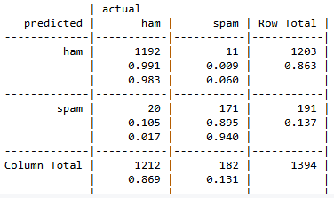
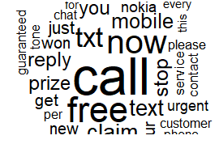

# sms-classification-naive-bayes
# 📩 SMS Spam Classification using Naive Bayes

## 📌 Overview
This project implements a machine learning model to classify SMS messages as **spam** or **ham (non-spam)** using the Naive Bayes algorithm.  
The workflow combines Natural Language Processing (NLP) techniques with statistical modeling to build an end-to-end text classification pipeline.

---

## 📂 Dataset
- SMS Spam Collection Dataset  
- Contains labeled SMS messages as **spam** or **ham**

---

## 🧠 Methodology

### 🔹 1. Text Preprocessing
- Converted text to lowercase  
- Removed numbers, punctuation, and stopwords  
- Applied **stemming** to normalize words  
- Removed extra whitespace  

### 🔹 2. Feature Engineering
- Created a **Document-Term Matrix (DTM)**  
- Selected frequent terms using a frequency threshold  
- Converted term frequencies into **binary features (Yes/No)**  

### 🔹 3. Model Building
- Trained a **Naive Bayes classifier**  
- Used the `e1071` package in R  

---

## ⚙️ Model Tuning
- Performed **hyperparameter tuning** using 10-fold cross-validation (`caret` package)  
- Tested multiple Laplace smoothing values:  
  `0, 0.5, 1, 1.5, 2`  

---

## 📊 Results

### ✅ Final Model (Laplace = 1)
- **Accuracy:** 97.78%  
- **Spam Recall:** 94.0%  
- **Precision (Spam):** 89.5%  
- **Missed Spam Messages:** 11 / 182  

---

## 📉 Model Comparison Insight

- Laplace = 0.5 achieved the highest cross-validation accuracy  
- However, it resulted in more **false negatives (missed spam)**  
- Laplace = 1 reduced missed spam significantly and improved recall  

👉 Therefore, **Laplace = 1** was selected as the final model, prioritizing spam detection performance.

---

## 📊 Exploratory Analysis
- Generated **word clouds** to visualize frequent terms  
- Spam messages commonly contained words like:
  - *free*, *call*, *now*, *urgent*, *prize*  
- These patterns support probabilistic classification using Naive Bayes  

---
## 📸 Visual Results

### 📊 Confusion Matrix


### ☁️ Spam Word Cloud


## 🛠️ Tools & Technologies
- R  
- tm (text mining)  
- e1071 (Naive Bayes)  
- caret (model tuning & cross-validation)  
- NLP techniques  
- WordCloud  

---

## 📎 Project Structure

```
sms-classification-naive-bayes/
│
├── spam_classification.R
├── README.md
├── confusion_matrix.png
├── spam_wordcloud.png
```


---

## 🧠 Key Learnings
- Text preprocessing and feature engineering for NLP  
- Probabilistic modeling using Naive Bayes  
- Hyperparameter tuning with cross-validation  
- Understanding trade-offs between **precision and recall**  

---

## 🚀 Future Improvements
- Try TF-IDF instead of binary features  
- Test other models (Logistic Regression, SVM)  
- Improve feature selection techniques  

---
